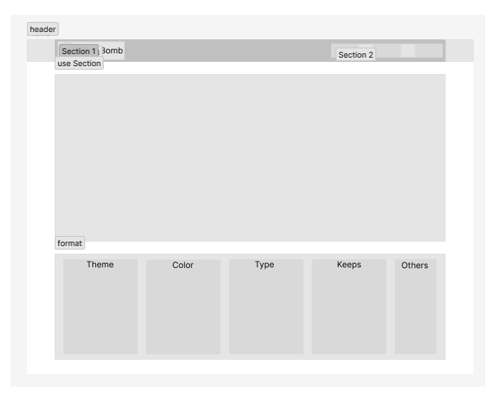
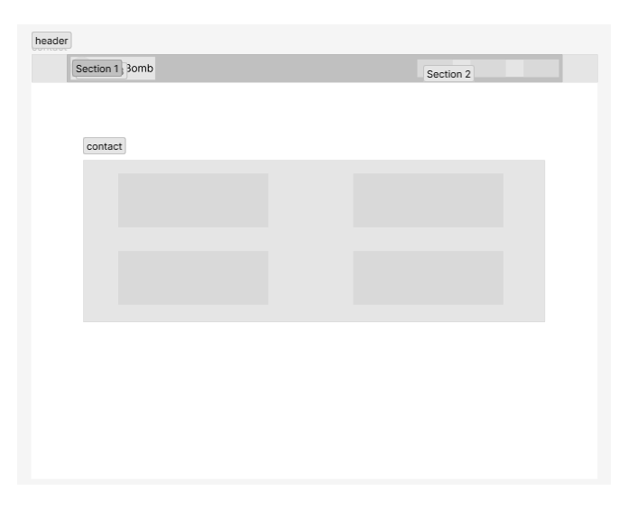

# BrainBomb

## 마인드맵 제작 웹페이지

### 구분 및 기획

#### 제작 계획

- 3페이지 이내의 쉽게 마인드맵을 그릴수 있는 웹페이지 제작.
- 로그인 및 인증 필요없이 단순 서비스 제공 (정적페이지)

#### 기획 의도

- 새로운 툴 및 기술 학습
- 마인드맵을 그리는 웹을 찾던 도중 매우 간단하고 정확히 마인드맵의 기능만 하는 웹페이지가 없다고 생각됨으로 간단 명료한 서비스제작의도

#### 기술 스택

- 사용 기술 : React, TypeScript, Redux, SCSS
- 새로 사용 기술 : Lodash, Styled-Component

### 제작

#### 예정 기능

- 일반적인 마인드 맵을 제작하지만, 다른 복잡한 절차 필요없이 사용가능.
- 이미지 및 pdf 등의 포멧변화를 통해 사용자가 원하는 형식으로 다운로드 가능.
- 마인드맵의 format에 여러가지 선택지를 만들어 사용자가 원하는 방식으로 제작.
- 마인드맵에서 각 element의 세부설정 가능하도록 함(색상, 형태, 선, 순서 등등);

### 스캐치

#### 페이지 1

- 마인드맵 제작 페이지
  

#### 페이지 2

- 마인드맵 사용법 페이지
  

#### 페이지 3

- 마인드맵 contact 페이지
  

# Work Through

230310

- 아이디어 구성 및 계획

230312

- 구체적 계획 및 기능 구상

230314

- 헤더 및 재사용 컴포넌트 제작

230316

- 마인드맵 기능 제작 (1일차)

230318

- 마인드맵 기능 제작 (2일차)
  - 마인드맵 자식엘리먼트 관련

230319

- 마인드맵 기능 제작 (3일차)
  - 마인드맵 자식엘리먼트 생성 및 삭제
  - 위치에 따른 엘리먼트 생성

230322

- 마인드맵 기능 관련 재구성 및 검토
  - CANVAS를 사용한 뷰 구성 혹은 일반 엘리먼트를 사용한 뷰 구성
  - 엘리먼트를 사용한 방식에는 드래그/드롭 기능을 통해 보다 유연한 기능을 제작하고자 함.
